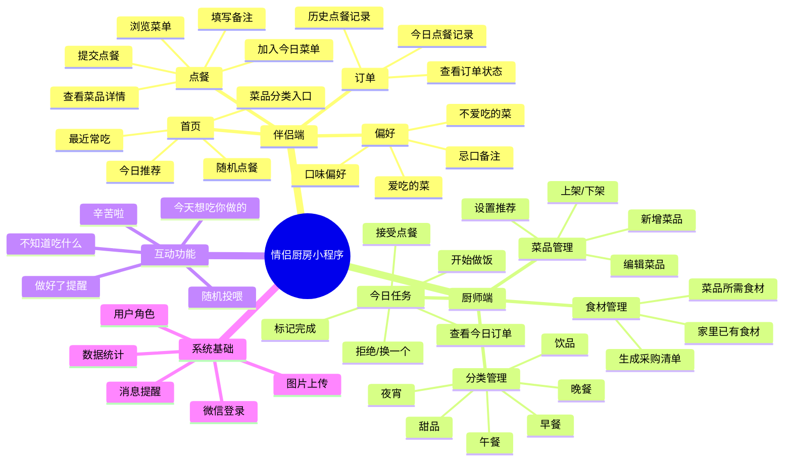

```mermaid
mindmap
  root((情侣厨房小程序))
    伴侣端
      首页
        今日推荐
        随机点餐
        最近常吃
        菜品分类入口
      点餐
        浏览菜单
        查看菜品详情
        加入今日菜单
        填写备注
        提交点餐
      订单
        今日点餐记录
        历史点餐记录
        查看订单状态
      偏好
        爱吃的菜
        不爱吃的菜
        忌口备注
        口味偏好
    厨师端
      今日任务
        查看今日订单
        接受点餐
        拒绝/换一个
        开始做饭
        标记完成
      菜品管理
        新增菜品
        编辑菜品
        上架/下架
        设置推荐
      分类管理
        早餐
        午餐
        晚餐
        夜宵
        甜品
        饮品
      食材管理
        菜品所需食材
        家里已有食材
        生成采购清单
    互动功能
      辛苦啦
      今天想吃你做的
      随机投喂
      不知道吃什么
      做好了提醒
    系统基础
      微信登录
      用户角色
      图片上传
      消息提醒
      数据统计
```