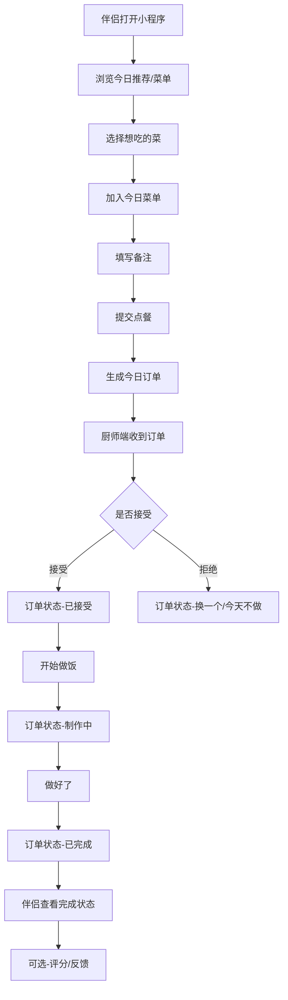

```mermaid
flowchart TD
  A[伴侣打开小程序] --> B[浏览今日推荐/菜单]
  B --> C[选择想吃的菜]
  C --> D[加入今日菜单]
  D --> E[填写备注]
  E --> F[提交点餐]

  F --> G[生成今日订单]
  G --> H[厨师端收到订单]

  H --> I{是否接受}
  I -->|接受| J[订单状态-已接受]
  I -->|拒绝| K[订单状态-换一个/今天不做]

  J --> L[开始做饭]
  L --> M[订单状态-制作中]
  M --> N[做好了]
  N --> O[订单状态-已完成]

  O --> P[伴侣查看完成状态]
  P --> Q[可选-评分/反馈]
```
