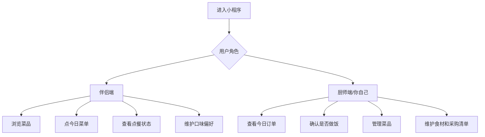

```mermaid
flowchart TD
  A[进入小程序] --> B{用户角色}

  B --> C[伴侣端]
  B --> D[厨师端/你自己]

  C --> C1[浏览菜品]
  C --> C2[点今日菜单]
  C --> C3[查看点餐状态]
  C --> C4[维护口味偏好]

  D --> D1[查看今日订单]
  D --> D2[确认是否做饭]
  D --> D3[管理菜品]
  D --> D4[维护食材和采购清单]
```