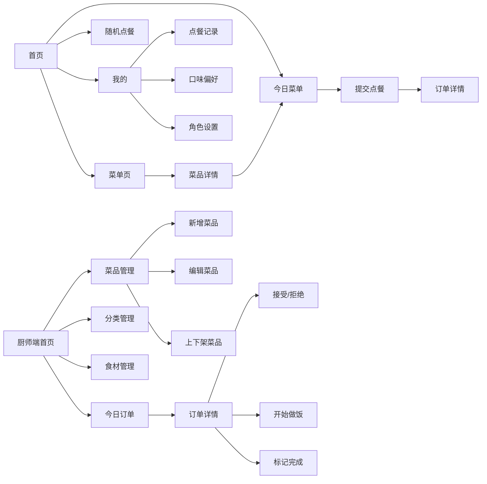

```mermaid
flowchart LR
    A[首页] --> B[菜单页]
    A --> C[随机点餐]
    A --> D[今日菜单]
    A --> E[我的]

    B --> B1[菜品详情]
    B1 --> D

    D --> D1[提交点餐]
    D1 --> F[订单详情]

    E --> E1[点餐记录]
    E --> E2[口味偏好]
    E --> E3[角色设置]

    G[厨师端首页] --> H[今日订单]
    G --> I[菜品管理]
    G --> J[分类管理]
    G --> K[食材管理]

    H --> H1[订单详情]
    H1 --> H2[接受/拒绝]
    H1 --> H3[开始做饭]
    H1 --> H4[标记完成]

    I --> I1[新增菜品]
    I --> I2[编辑菜品]
    I --> I3[上下架菜品]
```